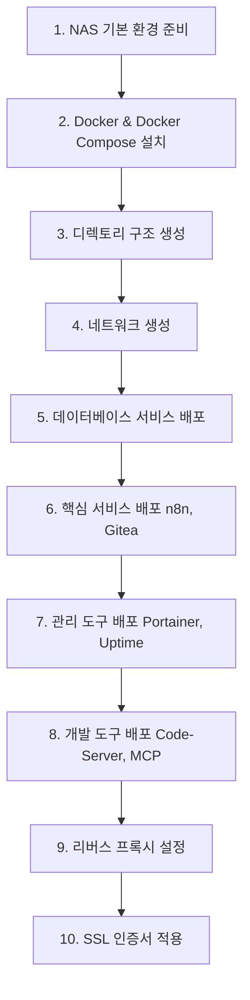

# NAS Docker 환경 설정 가이드

## 1. NAS Docker 디렉토리 구조 제안

```
/volume1/dev/
├── docker/                    # Docker Compose 파일들
│   ├── docker-compose.yml     # 통합 서비스 (권장)
│   ├── services/              # 개별 서비스별 구성
│   │   ├── n8n/
│   │   ├── gitea/
│   │   ├── code-server/
│   │   ├── uptime-kuma/
│   │   └── mcp-server/
│   └── scripts/               # 관리 스크립트
├── data/                      # 데이터 볼륨
│   ├── postgres/              # PostgreSQL 데이터
│   ├── n8n/                   # n8n 워크플로우 데이터
│   ├── gitea/                 # Gitea 저장소 데이터
│   ├── code-server/           # VS Code 설정
│   ├── uptime-kuma/           # 모니터링 데이터
│   └── portainer/             # Portainer 데이터
├── config/                    # 설정 파일
│   ├── nginx/                 # 리버스 프록시 설정 (선택)
│   ├── ssl/                   # SSL 인증서
│   └── backup/                # 백업 설정
└── logs/                      # 로그 파일
```

## 2. 배포 전략 제안

### 전략 A: 통합 Docker Compose (권장)
**장점:**
- 서비스 간 네트워킹 자동 구성
- 의존성 관리 용이
- 중앙화된 관리
- 리소스 효율성

**단점:**
- 한 서비스 문제 시 전체 영향 가능
- 개별 서비스 업데이트 복잡

### 전략 B: 개별 Docker Compose
**장점:**
- 서비스별 독립적 관리
- 개별 서비스 재시작 가능
- 문제 격리

**단점:**
- 네트워킹 설정 복잡
- 관리 포인트 증가

## 3. 권장 배포 순서



## 4. 실제 배포 스크립트 제안

### 4.1 NAS 초기 환경 설정 스크립트
```bash
#!/bin/bash
# setup-nas-docker-env.sh
# NAS에서 직접 실행할 환경 설정 스크립트

# 1. 디렉토리 생성
sudo mkdir -p /volume1/dev/{docker,data,config,logs}
sudo mkdir -p /volume1/dev/docker/{services,scripts}
sudo mkdir -p /volume1/dev/data/{postgres,n8n,gitea,code-server,uptime-kuma,portainer}
sudo mkdir -p /volume1/dev/config/{nginx,ssl,backup}

# 2. 권한 설정
sudo chown -R crossman:users /volume1/dev
chmod -R 755 /volume1/dev

# 3. Docker Compose 설치 확인
if ! command -v docker-compose &> /dev/null; then
    echo "Docker Compose 설치 중..."
    sudo curl -L "https://github.com/docker/compose/releases/latest/download/docker-compose-linux-x86_64" -o /usr/local/bin/docker-compose
    sudo chmod +x /usr/local/bin/docker-compose
fi

# 4. Docker 네트워크 생성
docker network create nas-services-network || true

echo "✅ NAS Docker 환경 설정 완료"
```

### 4.2 서비스별 배포 순서 스크립트
```bash
#!/bin/bash
# deploy-services-staged.sh
# 단계별 서비스 배포

deploy_stage() {
    local stage=$1
    local services=$2
    
    echo "🚀 Stage $stage 배포 시작: $services"
    cd /volume1/dev/docker
    
    case $stage in
        1) # 데이터베이스
            docker-compose up -d postgres
            ;;
        2) # 핵심 서비스
            docker-compose up -d n8n gitea
            ;;
        3) # 관리 도구
            docker-compose up -d portainer uptime-kuma
            ;;
        4) # 개발 도구
            docker-compose up -d code-server mcp-server
            ;;
    esac
    
    echo "⏳ $services 시작 대기 중..."
    sleep 30
    
    echo "✅ Stage $stage 완료"
    docker-compose ps
}

# 순차 배포 실행
deploy_stage 1 "PostgreSQL"
deploy_stage 2 "n8n, Gitea"
deploy_stage 3 "Portainer, Uptime Kuma"
deploy_stage 4 "Code-Server, MCP-Server"
```

## 5. 환경별 설정 파일 관리

### 5.1 .env 파일 구조 제안
```bash
# /volume1/dev/docker/.env

# ===========================================
# 기본 환경 설정
# ===========================================
COMPOSE_PROJECT_NAME=nas-services
DOCKER_NETWORK=nas-services-network

# NAS 정보
NAS_HOST=192.168.0.5
BASE_DOMAIN=crossman.synology.me

# ===========================================
# 데이터 경로
# ===========================================
DATA_ROOT=/volume1/dev/data
CONFIG_ROOT=/volume1/dev/config
LOGS_ROOT=/volume1/dev/logs

# ===========================================
# 서비스별 포트 매핑
# ===========================================
N8N_PORT=31001
MCP_PORT=31002
UPTIME_PORT=31003
CODE_PORT=8484
GITEA_HTTP_PORT=3000
GITEA_SSH_PORT=2222
PORTAINER_PORT=9000

# ===========================================
# 인증 정보
# ===========================================
DB_PASSWORD=your_secure_password_here
N8N_PASSWORD=your_n8n_password_here
VSCODE_PASSWORD=your_vscode_password_here

# ===========================================
# SSL & 도메인 설정
# ===========================================
SSL_EMAIL=admin@crossman.synology.me
ENABLE_SSL=true
```

### 5.2 최적화된 Docker Compose 구조
```yaml
# /volume1/dev/docker/docker-compose.yml
version: '3.8'

x-common-variables: &common-variables
  TZ: Asia/Seoul
  
x-restart-policy: &restart-policy
  restart: unless-stopped

networks:
  nas-services:
    external: true
    name: ${DOCKER_NETWORK}

volumes:
  postgres_data:
    driver: local
    driver_opts:
      type: none
      o: bind
      device: ${DATA_ROOT}/postgres
  # ... 기타 볼륨들

services:
  # 데이터베이스 (최우선)
  postgres:
    <<: *restart-policy
    image: postgres:16-alpine
    environment:
      <<: *common-variables
      POSTGRES_DB: nasdb
      POSTGRES_USER: nasuser
      POSTGRES_PASSWORD: ${DB_PASSWORD}
    volumes:
      - postgres_data:/var/lib/postgresql/data
    networks:
      - nas-services
    healthcheck:
      test: ["CMD-SHELL", "pg_isready -U nasuser -d nasdb"]
      interval: 10s
      timeout: 5s
      retries: 5

  # n8n (PostgreSQL 의존)
  n8n:
    <<: *restart-policy
    image: docker.n8n.io/n8nio/n8n:latest
    ports:
      - "${N8N_PORT}:5678"
    environment:
      <<: *common-variables
      DB_TYPE: postgresdb
      DB_POSTGRESDB_HOST: postgres
      DB_POSTGRESDB_DATABASE: nasdb
      DB_POSTGRESDB_USER: nasuser
      DB_POSTGRESDB_PASSWORD: ${DB_PASSWORD}
      N8N_BASIC_AUTH_ACTIVE: "true"
      N8N_BASIC_AUTH_USER: admin
      N8N_BASIC_AUTH_PASSWORD: ${N8N_PASSWORD}
      WEBHOOK_URL: https://n8n.${BASE_DOMAIN}
      N8N_BASE_URL: https://n8n.${BASE_DOMAIN}
    volumes:
      - ${DATA_ROOT}/n8n:/home/node/.n8n
    networks:
      - nas-services
    depends_on:
      postgres:
        condition: service_healthy

  # ... 기타 서비스들
```

## 6. 모니터링 및 관리 제안

### 6.1 헬스체크 스크립트
```bash
#!/bin/bash
# health-check.sh
# 모든 서비스 상태 확인

services=("postgres" "n8n" "gitea" "code-server" "uptime-kuma" "portainer" "mcp-server")
base_url="http://192.168.0.5"

echo "🏥 NAS Docker 서비스 헬스체크"
echo "==============================="

for service in "${services[@]}"; do
    case $service in
        "postgres")
            if docker exec nas-services_postgres_1 pg_isready -U nasuser -d nasdb > /dev/null 2>&1; then
                echo "✅ $service: 정상"
            else
                echo "❌ $service: 비정상"
            fi
            ;;
        "n8n")
            if curl -s "$base_url:31001" > /dev/null; then
                echo "✅ $service: 정상"
            else
                echo "❌ $service: 비정상"
            fi
            ;;
        # ... 기타 서비스들
    esac
done
```

## 7. 백업 및 복구 전략

### 7.1 자동 백업 스크립트
```bash
#!/bin/bash
# backup-services.sh
# 데이터 및 설정 백업

BACKUP_DIR="/volume1/backup/docker-services/$(date +%Y%m%d_%H%M%S)"
mkdir -p "$BACKUP_DIR"

# 1. Docker Compose 설정 백업
cp -r /volume1/dev/docker "$BACKUP_DIR/"

# 2. 데이터베이스 백업
docker exec nas-services_postgres_1 pg_dumpall -U nasuser > "$BACKUP_DIR/database_backup.sql"

# 3. 서비스 데이터 백업
tar -czf "$BACKUP_DIR/service_data.tar.gz" /volume1/dev/data

# 4. 설정 파일 백업
tar -czf "$BACKUP_DIR/config.tar.gz" /volume1/dev/config

echo "✅ 백업 완료: $BACKUP_DIR"
```

## 8. 제안하는 실행 순서

1. **NAS SSH 접속**
   ```bash
   ssh -p 22022 crossman@192.168.0.5
   ```

2. **환경 설정 스크립트 실행**
   ```bash
   curl -O https://raw.githubusercontent.com/your-repo/setup-nas-docker-env.sh
   chmod +x setup-nas-docker-env.sh
   ./setup-nas-docker-env.sh
   ```

3. **Docker Compose 파일 업로드**
   - SCP 또는 SFTP로 파일 전송
   - 또는 NAS 파일 스테이션 사용

4. **서비스 배포**
   ```bash
   cd /volume1/dev/docker
   docker-compose up -d
   ```

5. **상태 확인**
   ```bash
   docker-compose ps
   ./health-check.sh
   ```

이 방식으로 체계적이고 안정적인 NAS Docker 환경을 구축할 수 있습니다. 어떤 방식을 선호하시나요?
